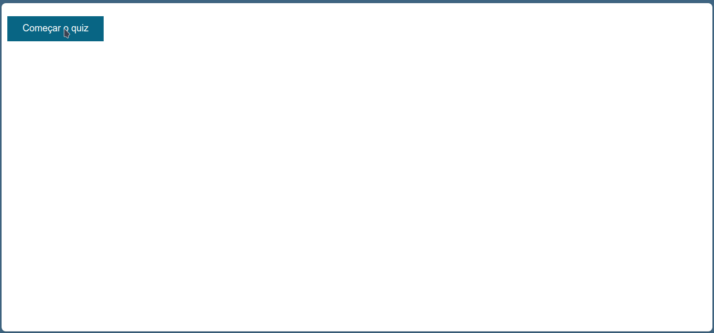

# Aplicação de Quiz

## 📖 Descrição

Esse projeto se refere a uma aplicação simples de Quiz usada para aplicar meus conhecimentos de Javascript. 

## 🛠️ Funcionalidades

- Jogo de quiz com 5 questões de entretenimento televisivo de nível fácil

## 📡 Tecnologias utilizadas

 

  

## ⏳ Inicialização

Esse projeto foi desenvolvido utilizando apenas HTML, CSS e Javascript puros. O projeto usa como backend a API [Open Trivia Database](https://opentdb.com/).

Existem várias formas de executar o projeto, uma delas é usar a extensão [Live Server](https://marketplace.visualstudio.com/items?itemName=ritwickdey.LiveServer&ssr=false#review-details) do VS Code. 

 

 

## 🤵🤵‍♀️ Colaboradores

O único colaborador desse projeto fui eu (Eduardo Vítor).

 

## 🔎 Status do Projeto

 

## 📑 Referências

[HTML](https://developer.mozilla.org/pt-BR/docs/Web/HTML)

[CSS](https://developer.mozilla.org/pt-BR/docs/Web/CSS)

[Javascript](https://developer.mozilla.org/pt-BR/docs/Web/JavaScript)

[Open Trivia Database](https://opentdb.com/)

[Live Server](https://marketplace.visualstudio.com/items?itemName=ritwickdey.LiveServer&ssr=false#review-details)

